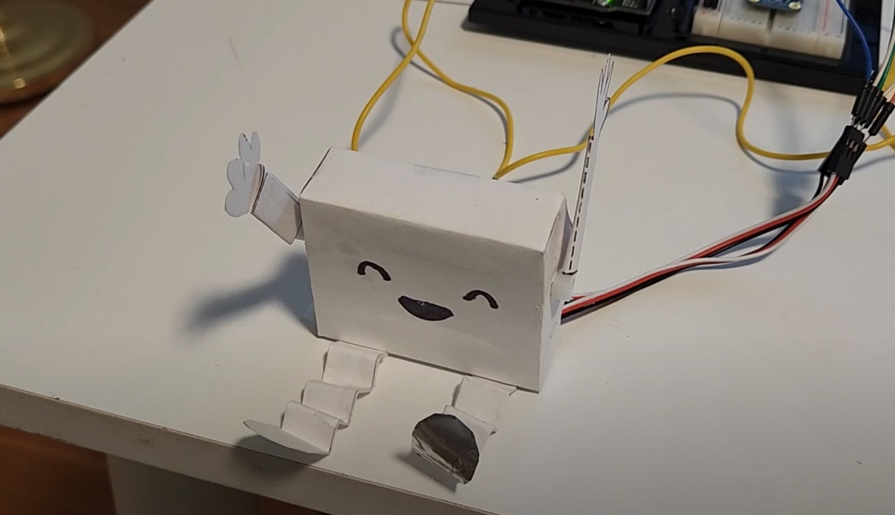
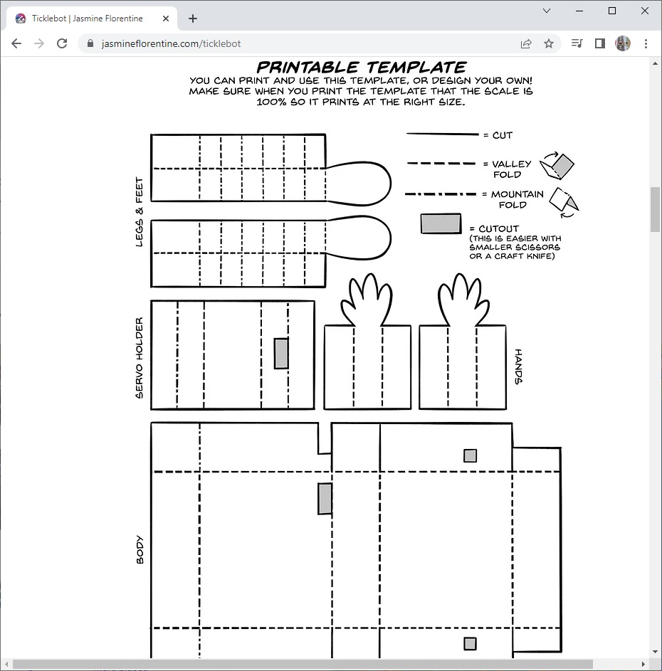
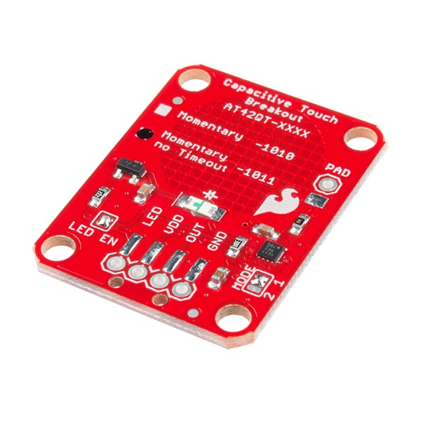

# Introduction
This repository contains code to control [Jasmine Florentine's Ticklebot](https://www.jasmineflorentine.com/ticklebot).
Jasmine's original robot was created for the [micro:bit platform](https://microbit.org/).
This repository assumes that you are using an [Arduino microcontroller](https://www.arduino.cc/) instead of a micro:bit device.

<a href="https://youtu.be/_OVYMaKuV4k"> Ticklebot YouTube Video</a>

# Constructing the Ticklebot
[Jasmine Florentine's web page](https://www.jasmineflorentine.com/) has excellent [detailed instructions](https://www.jasmineflorentine.com/ticklebot) on how to assemble the Ticklebot using card stock and a pair of micro servo motors.

<a href="https://www.jasmineflorentine.com/ticklebot"> Ticklebot Instructions (micro:bit)</a>

# Arduino Configuration
There are some slight differences between the micro:bit configuration and the Arduino version of the tickletbot.  
The micro:bit device includes a built-in capacitive touch sensor. A typical Arduino controller does not include
a capacitive touch sensor.

There is an [Arduino-compatible library](https://github.com/PaulStoffregen/CapacitiveSensor) that can be used to add this touch sensor capability to an Arduino controller.
For this project, however, I used a [SparkFun Capacitive Touch Sensor breakout board (AT42QT1011)](https://www.sparkfun.com/products/14520) instead of building a DIY touch sensor.  

<a href="https://www.sparkfun.com/products/14520"> SparkFun AT42QT1011 Capacitive Touch Sensor</a>

I selected the SparkFun capacitive touch sensor over the DIY sensor in case a student prefers to program their Arduino using the Scratch-based [mBlock coding platform](https://mblock.makeblock.com/en-us/).

Header pins were soldered to the SparkFun Capacitive Touch sensor to make it easier to use the device with a breadboard.  Also, a small segment of wire was soldered to the "PAD" pin of the capacitive touch sensor.  An alligator clip was then used to connect the "PAD" pin to the strip of foil on the understide of the ticklebot's left leg.

