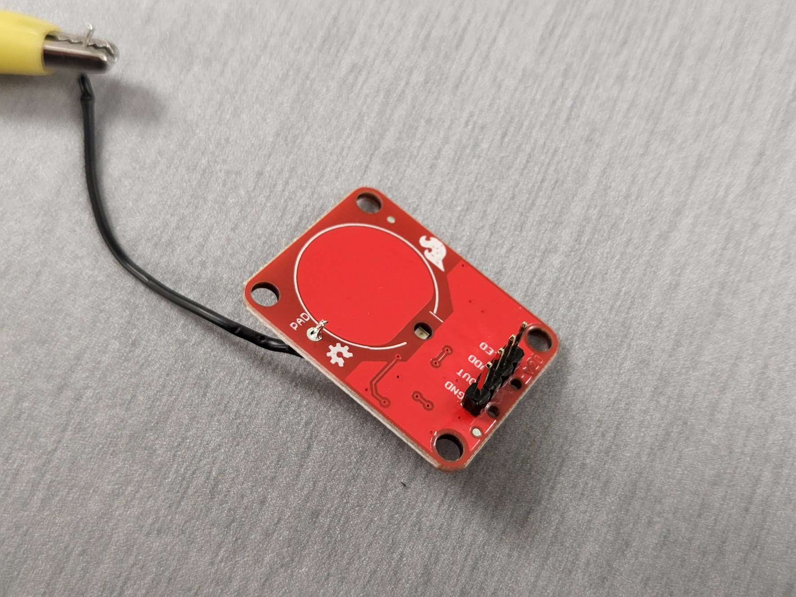
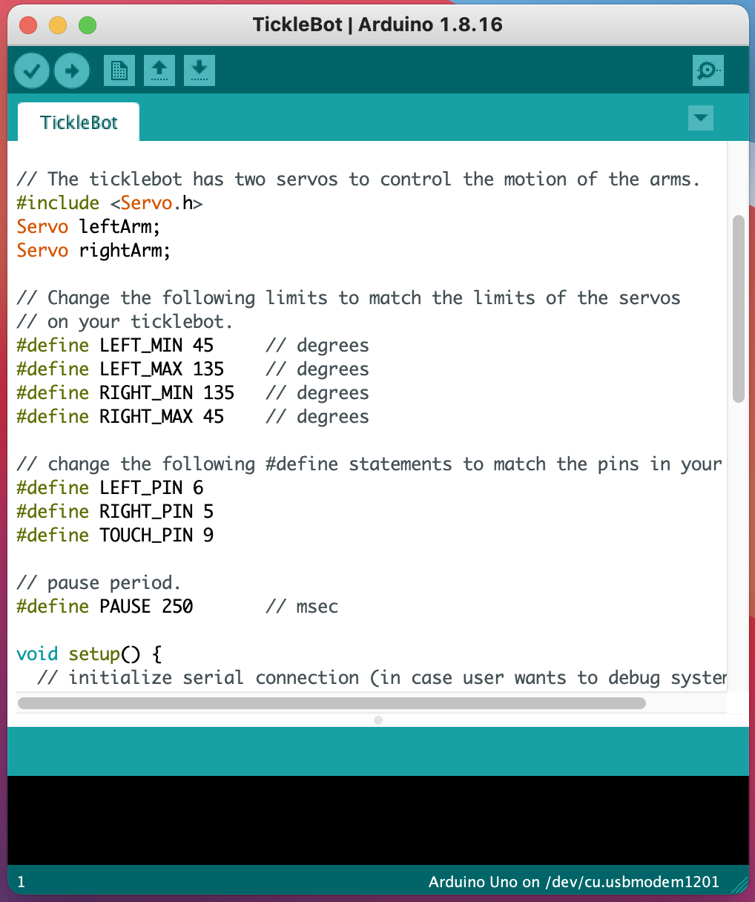
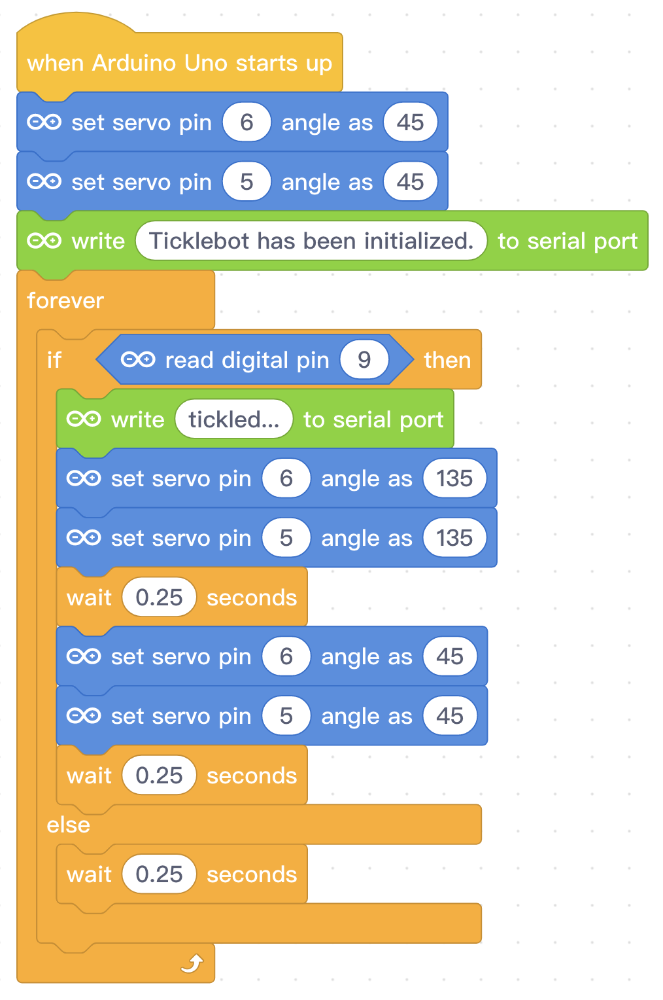

# Introduction
This repository contains code to control [Jasmine Florentine's Ticklebot](https://www.jasmineflorentine.com/ticklebot).
Jasmine's original robot was created for the [micro:bit platform](https://microbit.org/).
This repository assumes that you are using an [Arduino microcontroller](https://www.arduino.cc/) instead of a micro:bit device.

<a href="https://youtu.be/_OVYMaKuV4k"> Ticklebot YouTube Video</a>

# Quick Start Guide
<ol>
  
  <li>Use <a href="https://www.jasmineflorentine.com/ticklebot">instructions & template</a> to construct ticklebot from card stock.
  <li>Prepare the <a href = "https://www.sparkfun.com/products/14520">SparkFun Capacitive Touch Sensor</a> for use by soldering header pins and a length of wire to the board.
  <li>Use this <a href="images/Ticklebot_bb.png">circuit diagram</a> to wire the components of your system together.
  <li>Use either the <a href="./TickleBot.ino">text-based version of the TickleBot program</a> or the <a href="images/TickleBotMBlock.png">Scratch (mBlock) version of the program</a> to upload the logic to your Arduino.
  <li>After upload, touch the robot's aluminum-coated foot to tickle it.
</ol>
    
# Constructing the Ticklebot
[Jasmine Florentine's web page](https://www.jasmineflorentine.com/) has excellent [detailed instructions](https://www.jasmineflorentine.com/ticklebot) on how to assemble the ticklebot using card stock and a pair of micro servo motors.  Refer to Jasmine's instructions when constructing your ticklebot.

<a href="https://www.jasmineflorentine.com/ticklebot"> Ticklebot Instructions (micro:bit)</a>

# SparkFun Capacitive Touch Sensor
There are some slight differences between the micro:bit configuration and the Arduino version of the tickletbot.  
The micro:bit device includes a built-in capacitive touch sensor. A typical Arduino controller does not include
a capacitive touch sensor.

There is an [Arduino-compatible library](https://github.com/PaulStoffregen/CapacitiveSensor) that can be used to add this touch sensor capability to an Arduino controller.
For this project, however, I used a [SparkFun Capacitive Touch Sensor breakout board (AT42QT1011)](https://www.sparkfun.com/products/14520) instead of building a DIY touch sensor.  

<a href="https://www.sparkfun.com/products/14520"> SparkFun AT42QT1011 Capacitive Touch Sensor</a>

I selected the SparkFun capacitive touch sensor over the DIY sensor in case a student prefers to program their Arduino using the Scratch-based [mBlock coding platform](https://mblock.makeblock.com/en-us/).

Header pins were soldered to the SparkFun Capacitive Touch sensor to make it easier to use the device with a breadboard.  The touch sensor is installed on a breadboard and then connected to the Arduino using jumper wires. Also, a small segment of wire was soldered to the "PAD" pin of the capacitive touch sensor.  An alligator clip was then used to connect the "PAD" pin to the strip of foil on the understide of the ticklebot's left leg.

 Header pins and a length of wire were soldered to the sensor

 The sensor is installed onto a breadboard. An alligator clip connects the "PAD" wire to the ticklebot's leg.

# Servo Connections
Jumper wires are used to connect the Arduino controller to the micro servos that are used to control the ticklebot's arms.

 Use jumper wires to connect the servos to the Arduino pins.

# Circuit Diagram
The ticklebot program assumes that the left and right arm servos are connected to digital pins 6 and 5 respectively.  The ticklebot program also assumes that the output pin of the SparkFun capacitive touch sensor is connected to digital pin 9.  

Use the following circuit diagram to connect your components to the Arduino.

 Ticklebot circuit diagram.

In the circuit diagram above, the SparkFun sensor is depicted as being separate from the breadboard.  This was done for clarity.  For my ticklebot, I used the header pins to install the sensor onto the breadboard, and used jumper wires to connect the device to the appropriate Arduino pins.

 SparkFun sensor installed on breadboard.

# Programming the Ticklebot
Once you have your ticklebot constructed and wired, you can clone this repository or download the [program file](./TickleBot.ino) and use the [Arduino IDE software](https://www.arduino.cc/en/software) to install the program onto your Arduino controller.  Once you've flashed the program to the Arduino, you should be able to touch the ticklebot's foot (the one with the aluminum sole) and the arms of the bot should move.

<a href = "./TickleBot.ino"> TickleBot program.</a>

If you prefer to use the visual [mBlock programming environment](https://mblock.makeblock.com/en-us/) (which uses Scratch programming blocks) you can create an Arduino Scratch program using the following screenshot as a guide.

<a href="images/TickleBotMBlock.png"> mBlock version of program.</a>

# Troubleshooting the System
If your system doesn't behave as expected, you can check the [circuit diagram](images/Ticklebot_bb.png) to verify that your electrical connections are correct.  You can also use the Arduino [Serial Monitor software](https://docs.arduino.cc/software/ide-v2/tutorials/ide-v2-serial-monitor) to view the debug statements from the code. Note that the Arduino IDE version of the code (written in C++) uses a serial baud rate of 9600.  The mBlock version of the code uses a serial baud rate of 115200.

You can also look at the [issues database](https://github.com/tomeng70/TickleBot/issues) of this repository to see if other users had similar problems with their system.  You can also post questions in the issue database if you don't see an answer listed for your problem.
